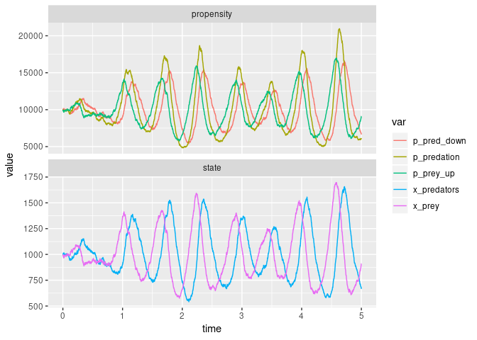

Preparing an SSA run with fastgssa.
================
2019-06-20

<!-- github markdown built using 
rmarkdown::render("vignettes/preparing_a_run.Rmd", output_format = "github_document")
-->

In order to invoke `ssa()`, the stochastic model needs at least four
components:

  - the initial state vector (`initial_state`),
  - the state-change matrix (`nu`),
  - the propensity functions (`propensity_funs`), and
  - the final time of the simulation (`final_time`).

The initial state vector defines the population sizes in all the states
at \(t = 0\). For example, for a system with two species `prey` and
`predators` where both have an initial population size of 1000, the
initial state vector is defined as .

The state-change matrix defines the change in the number of individuals
in each state (rows) as caused by one reaction of a given type
(columns). For example, a system with abovementioned species could have
three reactions; one in which the prey population grows, one in which
the predator population grows by feasting on the prey, and one in which
the predator population diminishes. The matrix could then be defined as
follows.

``` r
nu <- matrix(
  c(
    +1, -1, 0,
    0, +1, -1
  ),
  nrow = 2,
  byrow = TRUE,
  dimnames = list(
    c("x_prey", "x_predators"),
    c("p_prey_up", "p_predation", "p_pred_down")
  )
)
```

The propensity functions define the probabilities that a particular
reaction will occur over the next infinitesimal time interval
\(\left[t,t+dt \right]\). In the previous example, the propensity
functions and the corresponding constant parameters can be defined as
follows.

``` r
propensity_funs <- c(
  "p_prey_up = c1 * x_prey",
  "p_predation = c2 * x_prey * x_predators",
  "p_pred_down = c3 * x_predators"
)
params <- c(c1 = 10, c2 = 0.01, c3 = 10)
```

The simulation can be started by calling the `ssa()` function.

``` r
library(fastgssa)
out <- 
  ssa(
    initial_state = initial_state,
    propensity_funs = propensity_funs,
    nu = nu,
    params = params,
    method = ssa_direct(),
    final_time = 5,
    census_interval = .001,
    verbose = TRUE
  )
```

    ## Running SSA direct with console output every 1 seconds
    ## Start time: CURRTIME
    ## walltime: 0, simtime: 0
    ## SSA finished!

``` r
ssa_plot(out)
```

<!-- -->

The propensity functions should be valid `C++` code. If desired, a
buffer can be used to speed up the calculation of the propensity values,
for example as follows.

``` r
propensity_funs_with_buffer <- c(
  "calc1 = c1 * x_prey; p_prey_up = calc1 / (calc1 + 1)",
  "calc2 = c2 * x_prey * x_predators; p_predation = calc2 / (calc2 + 1)",
  "calc3 = c3 * x_predators; p_pred_down = calc3 / (calc3 + 1)"
)
```
